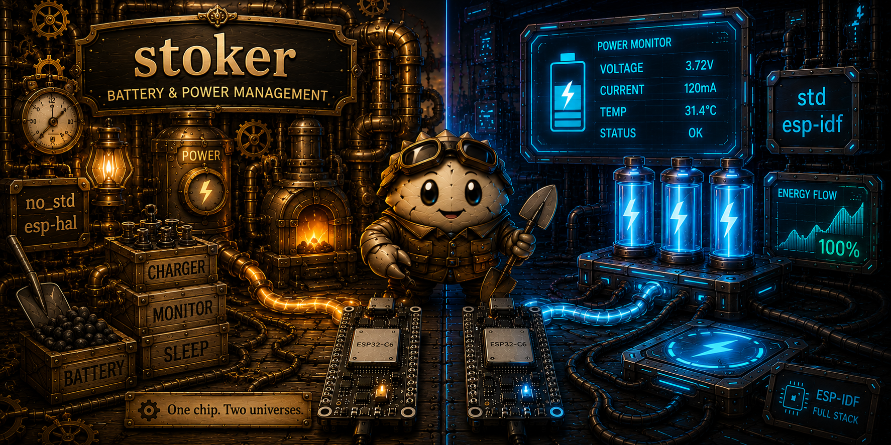
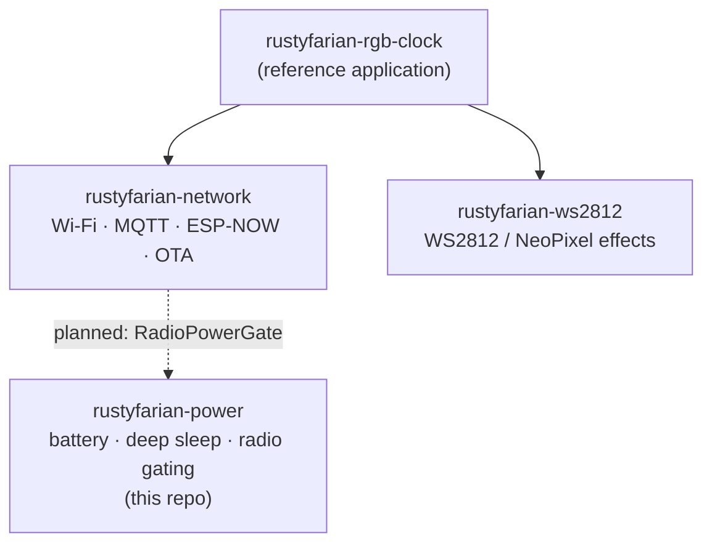

# Rustyfarian Power Management

<p align="center">
  
</p>

[](https://github.com/datenkollektiv/rustyfarian-power/actions/workflows/rust.yml)
[](#license)
[](https://www.rust-lang.org)
[](https://github.com/datenkollektiv/rustyfarian-power/actions/workflows/fmt.yml)
[](https://github.com/datenkollektiv/rustyfarian-power/actions/workflows/clippy.yml)
[](https://github.com/datenkollektiv/rustyfarian-power/actions/workflows/audit.yml)

A Rust library for power management on ESP32 microcontrollers, targeting the **Heltec WiFi LoRa 32 V3**.
Powers the rustyfarian ecosystem's battery-driven field deployments — from battery monitoring to deep sleep and radio power gating.

> **Note:** Large parts of this library (and its documentation) were developed with the assistance of AI tools.
> All generated code has been reviewed and curated by the maintainer.

## Rustyfarian Family

`rustyfarian-power` is one crate in the **rustyfarian** family — composable embedded-Rust libraries for
battery-powered ESP32 field deployments (e.g. remote beehive monitoring over LoRaWAN).



| Repo | Role |
|:-----|:-----|
| **rustyfarian-power** (this repo) | Battery monitoring, deep sleep, radio power gating |
| [rustyfarian-network](https://github.com/datenkollektiv/rustyfarian-network) | Wi-Fi, MQTT, LoRa, ESP-NOW, OTA |
| [rustyfarian-ws2812](https://github.com/datenkollektiv/rustyfarian-ws2812) | WS2812 / NeoPixel LED effects |
| [rustyfarian-rgb-clock](https://github.com/datenkollektiv/rustyfarian-rgb-clock) | Reference application tying the libraries together |

The `network → power` link (radio power gating via `RadioPowerGate`) is **planned**, not yet wired up — see [VISION.md](./VISION.md).

## Vision

> Give every rustyfarian application on ESP32 a single, ergonomic power management layer so battery-powered field deployments run reliably for months without intervention.

**We are building this for:** developers building battery-powered IoT applications in the rustyfarian ecosystem (e.g., remote beehive monitoring via LoRaWAN)

**Long-term goals:**
- Deep sleep with configurable wake-up sources as first-class primitives
- Radio power gating that coordinates cleanly with `rustyfarian-network` crates
- Solar-assisted deployment support via charging/boost input awareness

**Out of scope:** Wi-Fi, MQTT, and LoRaWAN protocol logic — these belong in `rustyfarian-network`.

*Full vision, success signals, and open questions: [VISION.md](./VISION.md)*

## Rustyfarian Philosophy

This library embodies the principle of **extracting testable pure logic from hardware-specific code** —
a pattern common in application development but rare in embedded Rust.

- **Hardware-independent core:** Voltage curves, sleep validation, wake-cause mapping, and configuration logic live in `config.rs` and `sleep.rs` — no ESP-IDF dependency, always compiled, fully testable on the host.
- **Thin ESP-IDF wrappers:** `esp_adc.rs` and `esp_sleep.rs` are minimal translation layers between Rust types and ESP-IDF FFI. Real logic stays in the core; the wrappers handle hardware lifecycle only.
- **Trait-first design:** Every hardware interaction is behind a trait (`BatteryMonitor`, `SleepManager`, `WakeCauseSource`). Consumers program against the trait, not the concrete type — enabling mock substitution in tests and alternative implementations in the future.
- **No-op mocks ship with the crate:** `NoopSleepManager` and `NoopBatteryMonitor` provide complete, host-testable stand-ins without any hardware. Consumer crates should use them in their own test suites, not invent their own mocks.
- **Fail-fast on misconfiguration:** Power management is operationally critical — silently entering a broken sleep state drains the battery. Errors in wake-source configuration are surfaced immediately and loudly, never swallowed.
- **Asymmetry encoded in the type system:** `esp_deep_sleep_start()` never returns, so `SleepManager::sleep()` and `WakeCauseSource::last_wake_cause()` are deliberately separate traits. Merging them would imply a round-trip that does not exist in hardware.

The core modules (`config.rs`, `sleep.rs`) can be fully unit-tested on your laptop without an ESP32 or ESP toolchain.

## Features

- Battery voltage reading via ADC with voltage divider compensation
- Linear interpolation for battery percentage (0–100%)
- Power source detection: Battery, USB/External, or Unknown
- Configurable thresholds (min/max voltage, USB detection, sample count)
- Deep sleep with timer wake and deterministic wake-cause detection
- Hardware-independent core logic behind traits for full host-side testability

## Examples

Two hardware targets are supported.
See [docs/hardware-setup.md](docs/hardware-setup.md) for wiring diagrams, ADC configuration, and power budgets.

| Board                     | Chip     | Example binary        | Run command                    |
|:--------------------------|:---------|:----------------------|:-------------------------------|
| Heltec WiFi LoRa 32 V3.1  | ESP32-S3 | `idf_esp32s3_battery` | `just run idf_esp32s3_battery` |
| Adafruit ESP32 Feather V2 | ESP32    | `idf_esp32_battery`   | `just run idf_esp32_battery`   |

The chip is inferred from the `idf_{chip}_{name}` prefix.
Connect the matching board before running — `espflash` will reject the binary if the wrong board is detected.

**Heltec WiFi LoRa 32 V3** (ESP32-S3) — reads battery voltage on GPIO1 every 2 s:

```shell
just run idf_esp32s3_battery
```

Expected serial output:

```text
[INFO] Battery monitor initialized (divider: 5.55x, range: 3000-4200mV)
Heltec V3.1 battery monitor — reading GPIO1 every 2 s
Battery: 3842mV (70%)
```

**Adafruit ESP32 Feather V2** (original ESP32) — reads battery and wake cause, then deep-sleeps for 60 s:

```shell
just run idf_esp32_battery
```

## Prerequisites

This project cross-compiles for the `xtensa-esp32s3-espidf` target using Espressif's custom Rust toolchain (`esp` channel).
See `rust-toolchain.toml` for toolchain configuration.

First-time setup:

```shell
just setup-toolchain
just setup-cargo-config
```

## Common Tasks

Run `just` with no arguments to list all available recipes.

Check platform-independent code (no ESP toolchain required):

```shell
just check
```

Check all code including ESP-IDF implementations (requires espup):

```shell
just check-all
```

Run host-side tests:

```shell
just test
```

Run a single test by name:

```shell
just test-one <test_name>
```

Format, check, lint, and test in one step:

```shell
just pre-commit
```

## Crates

This repository publishes two crates, one per tier (see [release-plan.md](release-plan.md)):

| Crate | Tier | Contents |
|:------|:-----|:---------|
| [`stoker`](crates/stoker) | Pure / host-buildable | `BatteryConfig`, `BatteryStatus`, `PowerSource`, the `BatteryMonitor` / `ChargingMonitor` / `SleepManager` / `WakeCauseSource` traits, `ChargingState`, `WakeCause` / `WakeSource`, sleep validation, and the `Noop*` host mocks. No ESP-IDF dependency; fully host-testable. |
| [`rustyfarian-esp-idf-power`](crates/rustyfarian-esp-idf-power) | ESP-IDF (std) | `EspAdcBatteryMonitor`, `EspSleepManager`, `EspWakeCauseSource`, `EspChargingMonitor`, plus the hardware examples. Re-exports `stoker`'s surface, so firmware imports from one crate. |

The pure core uses the rustyfarian family's funfair naming (`stoker`, joining `bunting` / `pennant` / `ferriswheel` / `juggler`); the hardware tier uses the technical `rustyfarian-<hal>-<repo>` convention.

## License

Licensed under either of

- [Apache License, Version 2.0](LICENSE-APACHE)
- [MIT License](LICENSE-MIT)

at your option.

Unless you explicitly state otherwise, any contribution intentionally submitted for inclusion in the work by you, as defined in the Apache-2.0 license, shall be dual licensed as above, without any additional terms or conditions.
