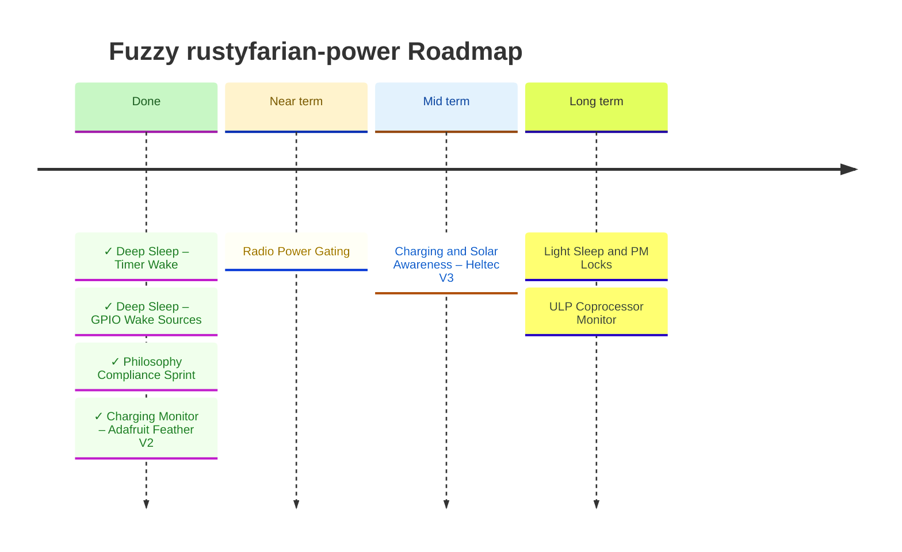

# Roadmap

> **North star:** Give every rustyfarian application on ESP32 a single, ergonomic power management layer so battery-powered field deployments run reliably for months without intervention.

See [VISION.md](./VISION.md) for goals, success signals, and non-goals.
See [CHANGELOG.md](./CHANGELOG.md) for the history of what has shipped.



---

## Architecture Decisions (Frozen)

These drive every milestone below.

- **Feature flags:** Single `esp-idf` gate for all hardware implementations.
  Optional `pm-locks` feature for the FreeRTOS PM lock wrapper (requires `CONFIG_PM_ENABLE` in `sdkconfig.defaults`).
- **Module layout:** Trait modules (`sleep.rs`, `radio_gate.rs`, `charging.rs`) are always compiled.
  ESP-IDF implementations (`esp_sleep.rs`, `esp_radio.rs`, `esp_charging.rs`) are feature-gated — mirrors the existing `lib.rs` / `esp_adc.rs` pattern.
- **Embassy:** Not applicable.
  This project runs ESP-IDF std / FreeRTOS, not bare-metal embassy.
  All sleep APIs are direct `esp-idf-sys` FFI calls.
- **Dependency direction:** `rustyfarian-power` defines `RadioPowerGate`; `rustyfarian-network` holds a reference to it.
  The power crate must never import the network crate.
- **Crate naming:** The crate is currently named `battery-monitor`.
  As scope expands to full power management, rename to `power-manager` at the next natural semver boundary.
  Not urgent while the workspace is private.
- **`LightSleepManager` gets its own trait, not `SleepManager`:** `esp_light_sleep_start()` returns after wake; merging it into `SleepManager` would corrupt the never-returns contract that is the entire point of the `SleepManager` / `WakeCauseSource` split.
  `LightSleepManager` has a distinct method `fn sleep(&mut self, sources: &[WakeSource]) -> anyhow::Result<WakeCause>` — the return type encodes the round-trip directly.
- **No-op mocks ship in the same commit as their trait:** Every trait milestone must include a `Noop*` implementation in the always-compiled module.
  Shipping the trait without the mock forces consumer crates to write their own mocks, which the philosophy explicitly prohibits.

---

## Milestone 3 — Radio Power Gating

**Goal:** A rustyfarian app can cut power to the SX1262 LoRa radio and OLED before entering deep sleep, reducing sleep current contribution of the radio from ~400 nA (SX1262 sleep mode) to 0 µA (VEXT off).

**Why next:** Radio power gating is the primary integration boundary with `rustyfarian-network`.
Getting the trait boundary right here (defined in power, implemented in power, consumed by network) is architecturally important.
It also eliminates the radio's quiescent contribution from the sleep current budget.

**Deliverables:**

- `radio_gate.rs` — public trait module (always compiled):
  - `RadioPowerGate` trait: `power_on(&mut self) -> anyhow::Result<()>`, `power_off(&mut self) -> anyhow::Result<()>`, `is_powered(&self) -> bool`
  - `NoopRadioPowerGate` — stateful mock: tracks `powered: bool`, returns `Ok(())` for on/off, returns the tracked state for `is_powered()`.
    Must ship in the same commit as the trait.
  - Pre-sleep sequence documentation (see below)
- `esp_radio.rs` — ESP-IDF implementation (feature-gated):
  - `GpioRadioPowerGate`: configurable enable GPIO (default GPIO 3 for Heltec V3 VEXT) and configurable stabilisation delay
- Documentation of the recommended pre-sleep sequence:
  1. Confirm any pending LoRa TX/RX is complete
  2. Send `SetSleep` to SX1262 over SPI
  3. Call `radio_gate.power_off()` (drives VEXT GPIO low)
  4. Call `sleep_manager.sleep(sources)`
- Note that GPIO 3 (VEXT) also gates the OLED display — powering off drops both
- Note that SX1262 requires full register re-initialisation on every wake (all state is lost when VEXT is cut; ~10–50 ms)

**Design decisions (locked):**
- `is_powered(&self) -> bool` reflects **last-known state** (memory), not a live hardware read.
  Document this explicitly in the trait: `is_powered()` returns the state as-set by the most recent `power_on()` / `power_off()` call; it does not sample the GPIO.
  `NoopRadioPowerGate` initialises `powered: false`.
- The trait must remain **object-safe**: no `Self: Sized` bounds, no generic methods.
  `rustyfarian-network` will hold a `&dyn RadioPowerGate` reference.
- **Stabilisation delay on the constructor only** (not on the trait) until an async consumer exists that needs to schedule against it.
- Validate any power-domain interaction in `GpioRadioPowerGate` before the FFI call, consistent with the fail-fast principle.

**Open questions (resolve before implementation):**
- Confirm GPIO 3 = VEXT on the Heltec WiFi LoRa 32 V3 schematic.
  The assignment varies between V2 and V3 board revisions; hardcoding the wrong pin silently breaks radio operation.

---

## Milestone 4 — Charging and Solar Awareness (Heltec V3 + Solar)

**Goal:** Heltec V3 charge-state detection and solar awareness, extending the Feather V2 foundation already shipped.
See [CHANGELOG.md](./CHANGELOG.md) for what shipped in the Feather V2 phase.

**Remaining deliverables:**

- `PowerSource::Solar` variant in `lib.rs` — **add `#[non_exhaustive]` to `PowerSource` first**, before the variant, to give downstream match arms a compile cycle.
- Heltec V3 `EspChargingMonitor` implementation: identify the charge controller IC and CHRG/STAT GPIO on the V3-specific schematic before writing any implementation.
  The V3 uses a different charge controller from the Feather V2 (not MCP73831).

**Design decisions (locked):**
- `ChargingState` and `PowerSource` are **orthogonal**: `PowerSource` answers "what supplies energy now"; `ChargingState` answers "what is the battery's charge trajectory."
  Nothing in the core merges them.
- Solar awareness is limited to detecting the charge controller CHRG pin state.
  MPPT interaction is out of scope for these boards.

**Open questions:**
- Identify the charge controller IC and CHRG/STAT GPIO on the Heltec WiFi LoRa 32 V3 schematic.
  Do not assume the Feather V2 wiring applies.
- Confirm whether `PowerSource::Solar` breaks any existing downstream match arms within the workspace before shipping.

---

## Milestone 5 — Light Sleep and PM Locks

**Goal:** Apps with sub-second wake intervals (e.g., a pulse-counting flow meter) can use light sleep rather than a busy loop, halving active current without the re-initialisation cost of deep sleep.

**Why fifth:** Light sleep retains CPU state and RAM — `esp_light_sleep_start()` returns after wake.
It is the right tool for sub-second intervals or when full hardware re-initialisation on every cycle is prohibitively expensive.
Power consumption (~800 µA–2 mA board-level) is higher than deep sleep and too high for the beehive use case, but appropriate for faster-cycling sensors.

`LightSleepManager` gets its **own trait**, not a configuration variant of `SleepManager`.
The return type encodes the semantic difference directly:

```rust
pub trait LightSleepManager {
    fn sleep(&mut self, sources: &[WakeSource]) -> anyhow::Result<WakeCause>;
}
```

**Deliverables:**

- `LightSleepManager` trait in `sleep.rs` (always compiled)
- `NoopLightSleepManager { cause: WakeCause }` in `sleep.rs` — programmed at construction time, returns the configured cause from `sleep()`
- `EspLightSleepManager` in `esp_sleep.rs` (feature-gated): calls `esp_light_sleep_start()`, reads `esp_sleep_get_wakeup_cause()` to produce `WakeCause`, and returns it
- `PmLock` wrapper for `esp_pm_lock_create()` / `esp_pm_lock_acquire()` / `esp_pm_lock_release()` — prevents automatic frequency scaling during critical sections
- `pm-locks` feature flag; document that it requires `CONFIG_PM_ENABLE=y` and `CONFIG_FREERTOS_USE_TICKLESS_IDLE=y` in `sdkconfig.defaults`

---

## Future — ULP Coprocessor Monitor

**Goal:** The ULP FSM samples battery ADC during deep sleep and wakes the CPU only when voltage crosses a threshold, eliminating unnecessary full-boot cycles.

**Why deferred:** High implementation complexity (ULP assembly or ULP-RISC-V C code compiled separately).
Not required for the initial beehive use case.
The `SleepManager` trait surface is designed to not foreclose this — a future `WakeSource::Ulp { condition }` variant can extend the enum.

**Deliverables (future):**
- ULP FSM program reading ADC1 during deep sleep
- `UlpWakeCondition` configuration (voltage threshold, hysteresis, sample interval)
- `WakeSource::Ulp { condition: UlpWakeCondition }` variant
- `WakeCause::Ulp` variant

**ESP32-S3 capability confirmation:** `SOC_ULP_FSM_SUPPORTED = 1`, `SOC_ULP_HAS_ADC = 1` — confirmed in `soc_caps.h` for the ESP32-S3.

---

## Open Questions

| Question                                                          | Blocks      | How to resolve                                                           |
|:------------------------------------------------------------------|:------------|:-------------------------------------------------------------------------|
| Is GPIO 3 = VEXT on the Heltec WiFi LoRa 32 V3?                   | Milestone 3 | Check the V3-specific schematic before writing `GpioRadioPowerGate`      |
| What is the charge controller IC and CHRG/STAT GPIO on Heltec V3? | Milestone 4 | Check the V3-specific schematic; do not assume Feather V2 wiring applies |
| Solar integration depth — CHRG pin only, or richer energy budget? | Milestone 4 | Confirmed as CHRG pin only for Heltec V3; revisit if hardware changes    |
