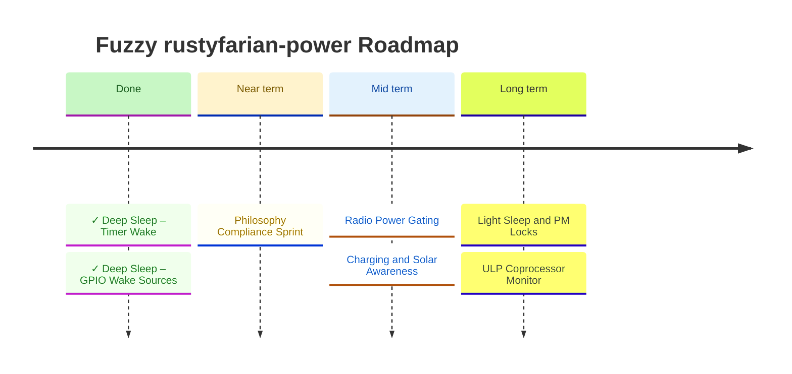

# Roadmap

> **North star:** Give every rustyfarian application on ESP32 a single, ergonomic power management layer so battery-powered field deployments run reliably for months without intervention.

See [VISION.md](./VISION.md) for goals, success signals, and non-goals.



---

## Current State

The `battery-monitor` crate is the foundation.
It provides battery voltage reading, percentage estimation, and power source detection via a hardware-independent `BatteryMonitor` trait backed by an ESP-IDF ADC implementation.

**What exists:**
- `BatteryMonitor` trait + `BatteryStatus` struct + `PowerSource` enum
- `BatteryConfig` with `evaluate_reading()` and `voltage_to_percent()`
- `EspAdcBatteryMonitor` (ADC1/GPIO1, feature-gated behind `esp-idf`)
- `SleepManager` + `WakeCauseSource` traits + `WakeCause` / `WakeSource` enums
- `WakeSource::GpioLevel { pin_mask, level }` with `validate_gpio_level_source()` host-testable validation
- `WakeCause::Ext1(GpioWakeMask)` / `Ext0` / `Gpio` — distinct variants, no ambiguous mask==0 case
- `EspSleepManager` + `EspWakeCauseSource` (feature-gated behind `esp-idf`)
- `NoopSleepManager` mock for host tests
- Host-side unit tests covering all branch cases (34 tests)

**What is missing:**
- Philosophy compliance sprint (see below — gaps identified by multi-agent review)
- Radio power gating (Milestone 3)
- Charging / solar awareness (Milestone 4)
- Light sleep / PM locks (Milestone 5)

---

## Architecture Decisions (Frozen)

These were decided during the vision session and drive every milestone below.

- **Feature flags:** Single `esp-idf` gate for all hardware implementations.
  Optional `pm-locks` feature for the FreeRTOS PM lock wrapper (requires `CONFIG_PM_ENABLE` in `sdkconfig.defaults`).
- **Module layout:** Trait modules (`sleep.rs`, `radio_gate.rs`, `charging.rs`) are always compiled.
  ESP-IDF implementations (`esp_sleep.rs`, `esp_radio.rs`, `esp_charging.rs`) are feature-gated — mirrors the existing `lib.rs` / `esp_adc.rs` pattern.
- **Embassy:** Not applicable.
  This project runs ESP-IDF std / FreeRTOS, not bare-metal embassy.
  All sleep APIs are direct `esp-idf-sys` FFI calls.
- **Dependency direction:** `rustyfarian-power` defines `RadioPowerGate`; `rustyfarian-network` holds a reference to it.
  The power crate must never import the network crate.
- **Crate naming:** The crate is currently named `battery-monitor`.
  As scope expands to full power management, rename to `power-manager` at the next natural semver boundary.
  Not urgent while the workspace is private.
- **`LightSleepManager` gets its own trait, not `SleepManager`:** `esp_light_sleep_start()` returns after wake; merging it into `SleepManager` would corrupt the never-returns contract that is the entire point of the `SleepManager` / `WakeCauseSource` split.
  `LightSleepManager` has a distinct method `fn sleep(&mut self, sources: &[WakeSource]) -> anyhow::Result<WakeCause>` — the return type encodes the round-trip directly.
- **No-op mocks ship in the same commit as their trait:** Every trait milestone must include a `Noop*` implementation in the always-compiled module.
  Shipping the trait without the mock forces consumer crates to write their own mocks, which the philosophy explicitly prohibits.

---

## ✓ Milestone 1 — Deep Sleep: Timer Wake — **COMPLETE** (commit `aea4645`)

**Goal:** Any rustyfarian app can enter deep sleep and wake on a configurable timer in under a day of integration work.

**Why first:** Board-level deep sleep draws ~100 µA (chip is ~7 µA; LDO, charge controller, and SX1262 add the rest).
Active mode draws 50–240 mA.
A beehive sensor transmitting every 10 minutes spends 99.7% of its time sleeping.
Nothing else in this roadmap matters without this primitive.
With deep sleep, a 3 000 mAh cell sustains approximately nine months of operation on timer-only cycles.

**Deliverables:**

- `sleep.rs` — public trait module (always compiled):
  - `WakeCause` enum: `PowerOn`, `Timer`, `Gpio`, `Touch`, `Other`
  - `WakeSource` enum: `Timer { duration_ms: u64 }` (expand in Milestone 2)
  - `SleepManager` trait: `fn sleep(&mut self, sources: &[WakeSource]) -> anyhow::Result<()>`
  - `WakeCauseSource` trait: `fn last_wake_cause(&self) -> WakeCause` (separate from `SleepManager` — see note below)
- `esp_sleep.rs` — ESP-IDF implementation (feature-gated):
  - `EspSleepManager`: calls `esp_sleep_enable_timer_wakeup()`, `esp_sleep_config_gpio_isolate()`, `esp_deep_sleep_start()`
  - `EspWakeCauseSource`: wraps `esp_sleep_get_wakeup_cause()`
- Mock `NoopSleepManager` for host tests
- Documentation covering the "does not return" semantics and how to persist state across deep sleep via `#[link_section = ".rtc.data"]`
- `sdkconfig.defaults` entry for any required sleep-related Kconfig options

**Design notes:**
- `SleepManager::sleep()` is fallible (`anyhow::Result`) — pre-sleep GPIO configuration can fail before sleep entry; silent failure would drain the battery
- `WakeCauseSource` is a separate trait because `sleep()` never returns on real hardware; the same instance cannot call both methods in one boot session
- `esp_sleep_get_wakeup_cause()` returns `UNDEFINED` on first boot (cold power-on), not only after wake — document and handle this in consumer guidance

**Verification:** `cargo test -p battery-monitor` covers mock path; flash test verifies real wake cycle on device.

---

## ✓ Milestone 2 — Deep Sleep: GPIO Wake Sources — **COMPLETE**

**Goal:** A sensor with an interrupt-generating peripheral (rain gauge, door contact, magnetic flow meter) can wake the ESP32 from a pulse on an RTC GPIO.

**Why second:** Timer wake covers regular-interval patterns; GPIO wake covers event-driven patterns.
Together they cover the two primary IoT sensor architectures.
Both are first-order requirements for the beehive monitoring use case (e.g., a tipping-bucket rain gauge).

**Deliverables (shipped):**

- `WakeSource::GpioLevel { pin_mask: u64, level: GpioWakeLevel }` variant in `sleep.rs`
- `GpioWakeLevel` enum: `AnyHigh`, `AnyLow` (not `High`/`Low` — avoids confusion with deprecated `ALL_LOW`)
- `GpioWakeMask(pub u64)` newtype with `contains_pin(pin: u8) -> bool` helper
- `validate_gpio_level_source(pin_mask: u64) -> anyhow::Result<()>` — pure function in `sleep.rs`, host-testable, called by `EspSleepManager` before any FFI call
- `WakeCause` split into distinct variants: `Ext1(GpioWakeMask)` (EXT1, has mask), `Ext0` (single-pin, no mask), `Gpio` (ESP32-S3 deep-sleep GPIO, no mask) — eliminates the ambiguous `Gpio(GpioWakeMask(0))` case
- `EspSleepManager::sleep()` handles `GpioLevel` via `esp_sleep_enable_ext1_wakeup_io()` (v5.x API)
- `GpioLevel` + `isolate_gpio: true` is a hard error (fail-fast over silent misconfiguration)
- 6 host-side tests covering all `validate_gpio_level_source` boundary conditions
- Full documentation: external pull resistors required, `isolate_gpio: false` required, ESP32-S3 target specificity noted

**Constraints:**
- EXT1 on ESP32-S3 supports RTC GPIOs 0–21 only
- `ESP_EXT1_WAKEUP_ALL_LOW` is deprecated — `AnyLow` maps to `ESP_EXT1_WAKEUP_ANY_LOW`

---

## Philosophy Compliance Sprint

**Goal:** Close the gaps between the stated rustyfarian philosophy and the current implementation before adding new hardware milestones.
Identified by a multi-agent philosophy review after M2 completion.

**Why now:** Every new milestone will compound these gaps.
A `NoopBatteryMonitor` that doesn't exist becomes three missing mocks by M4.
Validation logic locked behind `esp-idf` becomes harder to extract once more modules depend on it.
Fix the pattern while the codebase is still small.

**Deliverables:**

### Pure layer extraction (bring validation into the host-testable core)

- Extract `validate_wake_sources(sources: &[WakeSource]) -> anyhow::Result<()>` to `sleep.rs`:
  currently, the "at most one Timer" and "at most one GpioLevel" guards live in `esp_sleep.rs` and cannot be exercised without the `esp-idf` feature.
  Moving them to a pure function in `sleep.rs` makes them host-testable and available to any future `SleepManager` implementation.
- Add host-side unit tests for the extracted function:
  - more than one `Timer` source → error
  - more than one `GpioLevel` source → error
  - mixed valid sources → `Ok(())`

### Mock completeness

- Add `NoopBatteryMonitor` to `lib.rs`:
  `BatteryMonitor` is the only crate trait without a shipped mock.
  A `NoopBatteryMonitor { status: BatteryStatus }` with convenience constructors (`on_battery(mv, pct)`, `on_external()`, `unknown()`) lets consumer crates test `BatteryMonitor`-generic functions without hardware.
- Enhance `NoopSleepManager` to accept a configurable `WakeCause`:
  `NoopSleepManager::last_wake_cause()` always returns `PowerOn`, making it impossible to test consumer code that branches on `WakeCause::Timer` or `WakeCause::Ext1`.
  Add `NoopSleepManager::with_cause(WakeCause)` constructor and store the cause as a field.

### API ergonomics

- Derive `Copy` on `BatteryStatus`:
  all three fields (`u16`, `Option<u8>`, `PowerSource`) are `Copy`; the current `Clone`-only derivation forces callers to clone a status snapshot unnecessarily.

### Documentation

- Fix broken intra-doc links in `sleep.rs` module header:
  `[EspSleepManager]` and `[EspWakeCauseSource]` are feature-gated and produce `cargo doc` warnings when built without `esp-idf`.
  Replace with backtick names or add a `cfg_attr` doc gate.
- Add a crate-root `//!` usage example to `lib.rs`:
  the `cargo doc` entry point currently lists types without showing how to wire them together.
  A `rust,no_run` example showing battery read → wake cause check → sleep entry is the most important missing piece for new consumers.
- Add `NoopSleepManager` consumer guidance:
  the current doc says "for host-side unit testing" but does not make clear that this mock is intended for consumer crates' own test suites, not just rustyfarian-power's internal tests.
  Add a `# Examples` section demonstrating use inside a downstream library test.
- Add `docs/hardware-setup.md`:
  GPIO1 for ADC, voltage divider ratio and resistor values, 11 dB attenuation rationale, deep sleep current numbers, Heltec V3 pinout for all power-related pins.
  This prevents the most common new-contributor mistakes.

### Minor cleanups

- Document the 11 dB ADC attenuation derivation in `EspAdcBatteryMonitor::new()`:
  the attenuation is correct but opaque — one sentence explaining "11 dB selected for the 0–3100 mV range required by the 2:1 voltage divider on Heltec V3 GPIO1" makes it reviewable.
- Differentiate `BatteryConfig::heltec_v3()` from `BatteryConfig::default()`:
  currently they are identical; the 4300 mV USB detection threshold is Heltec V3-specific calibration, not a universal Li-ion constant.
  Either change `default()` to use more conservative values, or document clearly that `default()` == `heltec_v3()` intentionally.

---

## Milestone 3 — Radio Power Gating

**Goal:** A rustyfarian app can cut power to the SX1262 LoRa radio and OLED before entering deep sleep, reducing sleep current contribution of the radio from ~400 nA (SX1262 sleep mode) to 0 µA (VEXT off).

**Why third:** Radio power gating is the primary integration boundary with `rustyfarian-network`.
Getting the trait boundary right here (defined in power, implemented in power, consumed by network) is architecturally important.
It also eliminates the radio's quiescent contribution from the sleep current budget.

**Deliverables:**

- `radio_gate.rs` — public trait module (always compiled):
  - `RadioPowerGate` trait: `power_on(&mut self) -> anyhow::Result<()>`, `power_off(&mut self) -> anyhow::Result<()>`, `is_powered(&self) -> bool`
  - `NoopRadioPowerGate` — stateful mock: tracks `powered: bool`, returns `Ok(())` for on/off, returns the tracked state for `is_powered()`.
    Must ship in the same commit as the trait.
  - Pre-sleep sequence documentation (see below)
- `esp_radio.rs` — ESP-IDF implementation (feature-gated):
  - `GpioRadioPowerGate`: configurable enable GPIO (default GPIO 3 for Heltec V3 VEXT) and configurable stabilisation delay
- Documentation of the recommended pre-sleep sequence:
  1. Confirm any pending LoRa TX/RX is complete
  2. Send `SetSleep` to SX1262 over SPI
  3. Call `radio_gate.power_off()` (drives VEXT GPIO low)
  4. Call `sleep_manager.sleep(sources)`
- Note that GPIO 3 (VEXT) also gates the OLED display — powering off drops both
- Note that SX1262 requires full register re-initialisation on every wake (all state is lost when VEXT is cut; ~10–50 ms)

**Design decisions (locked):**
- `is_powered(&self) -> bool` reflects **last-known state** (memory), not a live hardware read.
  Document this explicitly in the trait: `is_powered()` returns the state as-set by the most recent `power_on()` / `power_off()` call; it does not sample the GPIO.
  `NoopRadioPowerGate` initialises `powered: false`.
- The trait must remain **object-safe**: no `Self: Sized` bounds, no generic methods.
  `rustyfarian-network` will hold a `&dyn RadioPowerGate` reference.
- **Stabilisation delay on the constructor only** (not on the trait) until an async consumer exists that needs to schedule against it.
- Validate any power-domain interaction in `GpioRadioPowerGate` before the FFI call, consistent with the fail-fast principle.

**Open questions (resolve before implementation):**
- Confirm GPIO 3 = VEXT on the Heltec WiFi LoRa 32 V3 schematic.
  The assignment varies between V2 and V3 board revisions; hardcoding the wrong pin silently breaks radio operation.

---

## Milestone 4 — Charging and Solar Awareness

**Goal:** A rustyfarian app can detect whether the device is discharging, charging from USB, or charging from solar, and make transmission throttling or scheduling decisions accordingly.

**Why fourth:** The solar power boost use case is explicitly named in the vision.
Charge-state awareness enables applications to transmit more aggressively when solar is available and to enter a "low-power hold" when the battery is critically low and uncharged — which is the primary failure mode for unattended field deployments.

**Deliverables:**

- `charging.rs` — public module (always compiled):
  - `ChargingSource` enum: `Usb`, `Solar`, `Unknown` — derive `Copy, Clone, Debug, PartialEq, Eq`
  - `ChargingState` enum: `Discharging`, `Charging { source: ChargingSource }`, `Full`, `NotPresent`, `Fault`, `Unknown` — derive `Copy, Clone, Debug, PartialEq, Eq`
  - `ChargingMonitor` trait: `fn read_charging_state(&mut self) -> ChargingState` (infallible, absorbs errors into `Unknown`)
  - `NoopChargingMonitor { state: ChargingState }` — constructor-programmable mock; `Default` returns `ChargingState::Unknown` (never `Discharging`, which would trigger incorrect application low-power logic).
    Ships in the same commit as the trait.
  - `fn chrg_pin_level_to_state(low: bool) -> ChargingState` — pure helper in `charging.rs`: `low == true` → `Charging { source: ChargingSource::Unknown }`, `low == false` → `Discharging`. Host-testable. Called by `GpioChargingMonitor` before returning.
- `esp_charging.rs` — ESP-IDF implementation (feature-gated):
  - `GpioChargingMonitor`: reads TP4054 CHRG status pin via GPIO to detect active charging; delegates to `chrg_pin_level_to_state()`
- `PowerSource::Solar` variant added to `lib.rs` — **this is the first change in M4, before any other M4 code.**
  Add `#[non_exhaustive]` to `PowerSource` at the same time (required even while the workspace is private — prevents downstream match arms from silently being exhaustive when `Solar` is added).

**Design decisions (locked):**
- `ChargingState` and `PowerSource` are **orthogonal**: `PowerSource` answers "what supplies energy now"; `ChargingState` answers "what is the battery's charge trajectory."
  Nothing in the core merges them.
  The application layer interprets both together.
- The `#[non_exhaustive]` attribute goes on `PowerSource` **before** `Solar` is added, not at the same time.
  This gives downstream consumers a compile cycle to add `_ =>` arms before the new variant appears.

**Open questions (resolve before implementation):**
- Identify the TP4054 CHRG pin on the Heltec WiFi LoRa 32 V3 schematic.
  The CHRG pin may or may not be connected to an ESP32 GPIO on this board revision.
  Do not assume it matches common Heltec documentation — check the V3-specific schematic.
- Confirm whether `PowerSource::Solar` breaks any existing downstream match arms within the workspace before shipping.

**Constraints:**
- The TP4054 charge controller has no I2C/SPI interface and no MPPT capability.
  Solar awareness is limited to detecting the CHRG pin state.
  MPPT interaction is out of scope for this board.

---

## Milestone 5 — Light Sleep and PM Locks

**Goal:** Apps with sub-second wake intervals (e.g., a pulse-counting flow meter) can use light sleep rather than a busy loop, halving active current without the re-initialisation cost of deep sleep.

**Why fifth:** Light sleep retains CPU state and RAM — `esp_light_sleep_start()` returns after wake.
It is the right tool for sub-second intervals or when full hardware re-initialisation on every cycle is prohibitively expensive.
Power consumption (~800 µA–2 mA board-level) is higher than deep sleep and too high for the beehive use case, but appropriate for faster-cycling sensors.

**Design decision (locked — supersedes earlier ROADMAP note):**

`LightSleepManager` gets its **own trait**, not a configuration variant of `SleepManager`.
Rationale: `esp_light_sleep_start()` always returns; merging it into `SleepManager` would corrupt the never-returns contract that motivates the `SleepManager` / `WakeCauseSource` split.
The return type encodes the semantic difference directly:

```rust
pub trait LightSleepManager {
    fn sleep(&mut self, sources: &[WakeSource]) -> anyhow::Result<WakeCause>;
}
```

The caller receives `WakeCause` on the same call chain (no separate `WakeCauseSource` read needed).
`NoopLightSleepManager { cause: WakeCause }` ships in `sleep.rs` alongside the trait — same-commit requirement.

The `SleepManager` doc comment must be updated to specify it is a **deep sleep** trait; the ambiguous "On host targets the call returns" phrasing must be removed to prevent callers from writing `unreachable!()` after a light sleep call.

**Deliverables:**

- `LightSleepManager` trait in `sleep.rs` (always compiled) with `fn sleep(&mut self, sources: &[WakeSource]) -> anyhow::Result<WakeCause>`
- `NoopLightSleepManager { cause: WakeCause }` in `sleep.rs` — programmed at construction time, returns the configured cause from `sleep()`
- `EspLightSleepManager` in `esp_sleep.rs` (feature-gated): calls `esp_light_sleep_start()`, reads `esp_sleep_get_wakeup_cause()` to produce `WakeCause`, and returns it
- `PmLock` wrapper for `esp_pm_lock_create()` / `esp_pm_lock_acquire()` / `esp_pm_lock_release()` — prevents automatic frequency scaling during critical sections
- `pm-locks` feature flag; document that it requires `CONFIG_PM_ENABLE=y` and `CONFIG_FREERTOS_USE_TICKLESS_IDLE=y` in `sdkconfig.defaults`
- Documentation distinguishing light sleep from deep sleep and guiding the choice

---

## Future — ULP Coprocessor Monitor

**Goal:** The ULP FSM samples battery ADC during deep sleep and wakes the CPU only when voltage crosses a threshold, eliminating unnecessary full-boot cycles.

**Why deferred:** High implementation complexity (ULP assembly or ULP-RISC-V C code compiled separately).
Not required for the initial beehive use case.
The `SleepManager` trait surface is designed to not foreclose this — a future `WakeSource::Ulp { condition }` variant can extend the enum.

**Deliverables (future):**
- ULP FSM program reading ADC1 during deep sleep
- `UlpWakeCondition` configuration (voltage threshold, hysteresis, sample interval)
- `WakeSource::Ulp { condition: UlpWakeCondition }` variant
- `WakeCause::Ulp` variant

**ESP32-S3 capability confirmation:** `SOC_ULP_FSM_SUPPORTED = 1`, `SOC_ULP_HAS_ADC = 1` — confirmed in `soc_caps.h` for the ESP32-S3.

---

## Open Questions

| Question                                                                                                                 | Blocks                   | How to resolve                                                                         |
|:-------------------------------------------------------------------------------------------------------------------------|:-------------------------|:---------------------------------------------------------------------------------------|
| Is GPIO 3 = VEXT on the Heltec WiFi LoRa 32 V3?                                                                          | Milestone 3              | Check the V3-specific schematic before writing `GpioRadioPowerGate`                    |
| Is the TP4054 CHRG pin connected to an ESP32 GPIO on Heltec V3?                                                          | Milestone 4              | Check the V3-specific schematic; identify pin number                                   |
| Solar integration depth — CHRG pin only, or richer energy budget?                                                        | Milestone 4              | Confirmed as CHRG pin only for Heltec V3; revisit if hardware changes                  |
| ~~`pin_mask: u64` vs `&[u8]` pin list for `WakeSource::GpioLevel`?~~ **Resolved:** `pin_mask: u64`                       | ~~Milestone 2~~          | ~~Decide before implementing~~ See `docs/key-insights.md`                              |
| ~~Add `#[non_exhaustive]` to `PowerSource` before publishing?~~ **Resolved:** add before `Solar` variant, not at publish | ~~Milestone 4~~          | Add `#[non_exhaustive]` as the **first** change in M4                                  |
| ~~Radio stabilisation delay on `RadioPowerGate` trait or constructor only?~~ **Resolved:** constructor only              | ~~Milestone 3~~          | ~~Defer until async consumer exists~~                                                  |
| ~~`LightSleepManager`: share `SleepManager` trait or separate?~~ **Resolved:** separate trait                            | ~~Milestone 5~~          | ~~Decide before M5~~ — see Architecture Decisions above                                |
