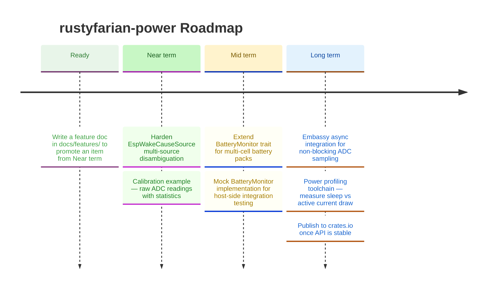

# Roadmap

*Last updated: May 2026*

Charging detection shipped as a dedicated `ChargingMonitor` trait rather than a `PowerSource` enum variant, keeping power-source identity and charge-state lifecycle as orthogonal concerns.
Hardware wiring documentation for both Heltec V3 and Feather V2 is complete.
Near-term focus shifts to wake-cause disambiguation for multi-source GPIO configurations and a calibration example for ADC validation in the field.

