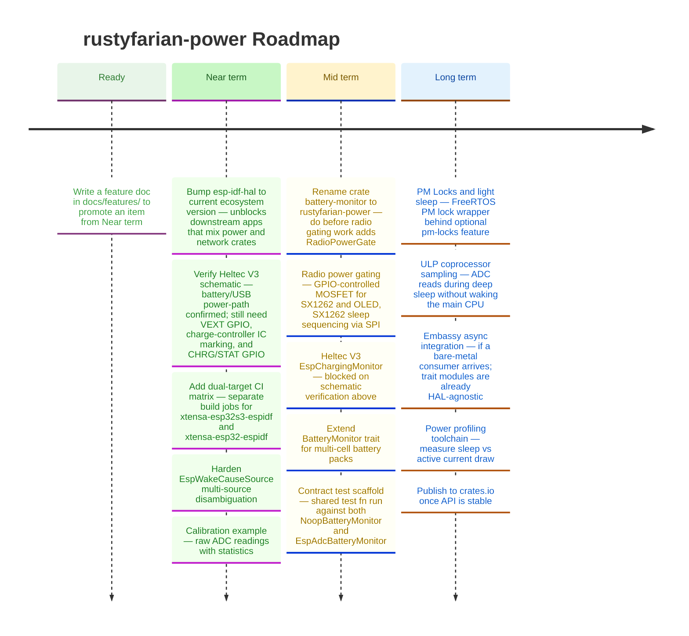

# Roadmap

*Last updated: June 2026*

Charging detection and deep-sleep wake-source handling are working on both Heltec V3 and Adafruit Feather V2.
The Feather V2 has a complete `EspChargingMonitor`; the Heltec V3 charging implementation is blocked on schematic verification of the charge controller IC and its GPIO — an inversion relative to the README's "primary target" framing that near-term work must resolve.
Simultaneous battery + USB operation is confirmed safe and intended on both boards (vendor docs cited in `docs/key-insights.md`); what remains for Heltec is the exact charger-IC marking and a STAT/CHRG status GPIO.
The workspace `esp-idf-hal` dependency is pinned to `0.45` while the broader ecosystem moved to `0.46`+ in April 2026; the upgrade is the highest-priority near-term maintenance task because a downstream app combining `rustyfarian-power` and `rustyfarian-network` will hit a Cargo resolution conflict at their current versions.

