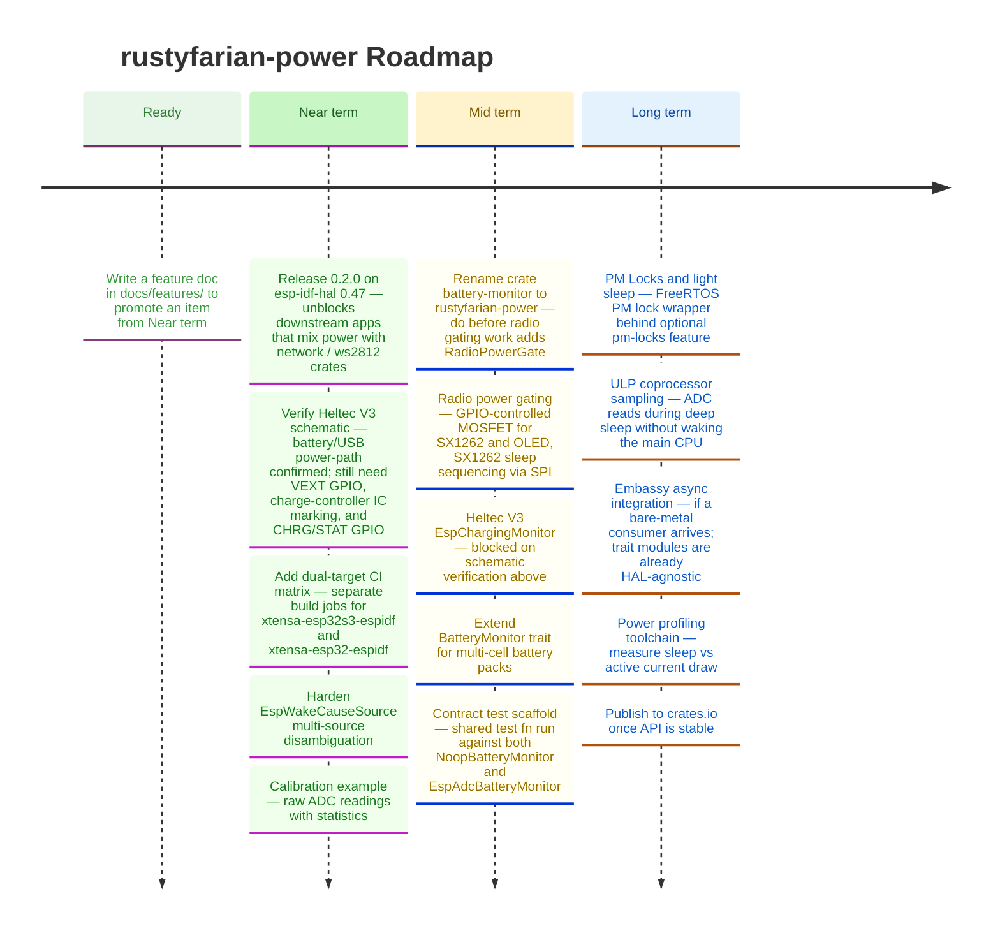

# Roadmap

*Last updated: September 2026*

Charging detection and deep-sleep wake-source handling are working on both Heltec V3 and Adafruit Feather V2.
The Feather V2 has a complete `EspChargingMonitor`; the Heltec V3 charging implementation is blocked on schematic verification of the charge controller IC and its GPIO — an inversion relative to the README's "primary target" framing that near-term work must resolve.
Simultaneous battery + USB operation is confirmed safe and intended on both boards (vendor docs cited in `docs/key-insights.md`); what remains for Heltec is the exact charger-IC marking and a STAT/CHRG status GPIO.
The ESP-IDF tier moved to the September 2026 family stack (`esp-idf-hal 0.47` / `esp-idf-sys 0.38.1`) on 2026-09-26, in step with `rustyfarian-network`, `-ws2812` and `-peripherals`.
The published `0.1.0` still pins `esp-idf-hal 0.46`, and `esp-idf-sys` is a `links` crate, so downstream apps can only combine power with the siblings once a `0.2.0` release ships.

```mermaid
%%{init: {
  "theme": "base",
  "themeVariables": {
    "cScale0": "#e8f5e9",
    "cScaleLabel0": "#2e7d32",
    "cScale1": "#c8f7c5",
    "cScaleLabel1": "#1b5e20",
    "cScale2": "#fff3cd",
    "cScaleLabel2": "#7a5a00",
    "cScale3": "#e3f2fd",
    "cScaleLabel3": "#0d47a1"
  }
}}%%

timeline
    title rustyfarian-power Roadmap

    Ready     : Write a feature doc in docs/features/ to promote an item from Near term

    Near term : Release 0.2.0 on esp-idf-hal 0.47 — unblocks downstream apps that mix power with network / ws2812 crates
              : Verify Heltec V3 schematic — battery/USB power-path confirmed; still need VEXT GPIO, charge-controller IC marking, and CHRG/STAT GPIO
              : Add dual-target CI matrix — separate build jobs for xtensa-esp32s3-espidf and xtensa-esp32-espidf
              : Harden EspWakeCauseSource multi-source disambiguation
              : Calibration example — raw ADC readings with statistics

    Mid term  : Rename crate battery-monitor to rustyfarian-power — do before radio gating work adds RadioPowerGate
              : Radio power gating — GPIO-controlled MOSFET for SX1262 and OLED, SX1262 sleep sequencing via SPI
              : Heltec V3 EspChargingMonitor — blocked on schematic verification above
              : Extend BatteryMonitor trait for multi-cell battery packs
              : Contract test scaffold — shared test fn run against both NoopBatteryMonitor and EspAdcBatteryMonitor

    Long term : PM Locks and light sleep — FreeRTOS PM lock wrapper behind optional pm-locks feature
              : ULP coprocessor sampling — ADC reads during deep sleep without waking the main CPU
              : Embassy async integration — if a bare-metal consumer arrives; trait modules are already HAL-agnostic
              : Power profiling toolchain — measure sleep vs active current draw
              : Publish to crates.io once API is stable
```
